# Driver Emotion and Fatigue Alert System (DEFAS)

The Driver Emotion and Fatigue Alert System (**DEFAS**) is a comprehensive real-time driver monitoring solution optimized for hardware-constrained vehicle cabin environments. The system implements a **hybrid approach** combining **3D geometric facial landmark analysis** for biological states (blinking, yawning, head nodding) with a **fine-tuned deep convolutional neural network (MobileNetV3)** to classify negative driver emotional states (anger, panic).

Developed as a Graduation Thesis for the **School of Information and Communication Technology (SOICT), Hanoi University of Science and Technology (HUST)**.

---

## Simulation Architecture

The project operates under a simulated client-central architecture, enabling local monitoring programs to send telemetry to a centralized simulation application:

```
                  ┌──────────────────────────────┐
                  │    Camera / Video Stream     │
                  └──────────────┬───────────────┘
                                 │ RGB Frames
                                 ▼
          ┌──────────────────────────────────────────────┐
          │           Local Monitoring Apps              │
          │  - PC App (Python, MediaPipe, PyTorch)       │
          │  - Mobile App (Flutter, ML Kit, PyTorch)     │
          └───────────────┬──────────────────────┬───────┘
                          │                      │
                          │ HTTP POST            │ Audio Alarms
                          │ (Telemetry payload)  ▼
                          ▼             ┌─────────────────┐
         ┌────────────────────────────┐ │   Local Alert   │
         │   Centralized Simulation   │ └─────────────────┘
         │    Management Program      │
         └──────────────┬─────────────┘
                        ├────────────────────────┐
                        ▼                        ▼
               ┌─────────────────┐      ┌─────────────────┐
               │ SQLite Database │      │   Monitoring    │
               │  (Warning Logs) │      │  Simulation UI  │
               └─────────────────┘      └─────────────────┘
```

1. **Local Monitoring (PC/Mobile Apps):** Performs real-time geometric landmark extraction, calculates Eye Aspect Ratio (EAR), Mouth Aspect Ratio (MAR), and head rotation angles (Pitch, Roll, Yaw) using PnP. It runs priority decision logic and triggers audio warnings locally.
2. **Centralized Simulation Management Program (Flask):** Receives telemetry data from local apps, updates the database, applies a debounce filter (10-second cooldown), and logs warning histories.
3. **Monitoring Simulation UI (Dashboard):** Displays real-time charts showing driver fatigue metrics, emotional probabilities, and safety scores, while allowing users to query warning history and manage registered vehicles.

---

## System Preview

### PC Monitoring Application HUD
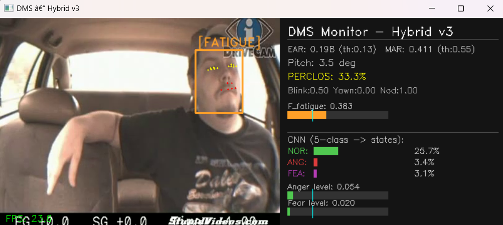

### Web Monitoring Dashboard
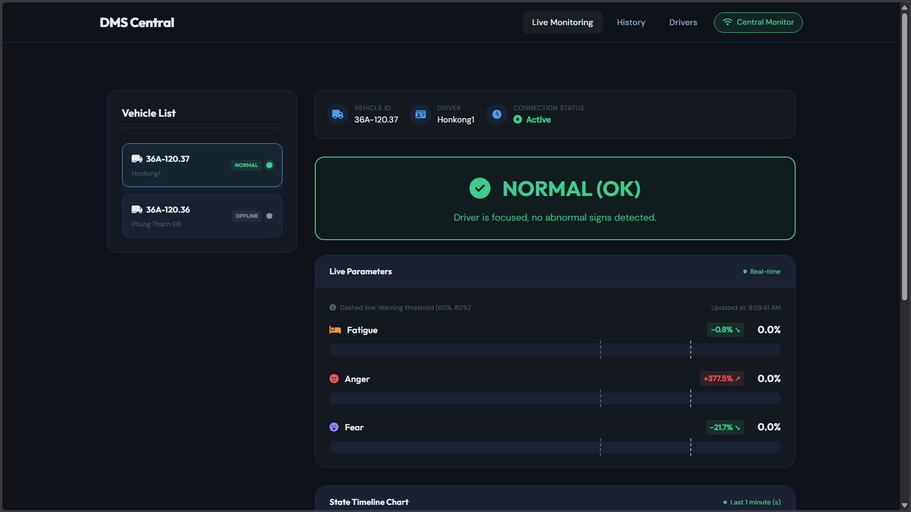

### Mobile App (Flutter)
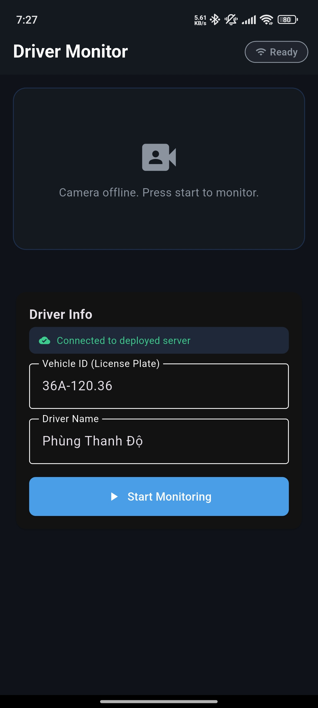

### Real-Time Detection Scenarios

The system runs real-time hybrid decision logic to classify the driver's state into five distinct categories:

| **Normal State** | **Fatigue State** |
| :---: | :---: |
| 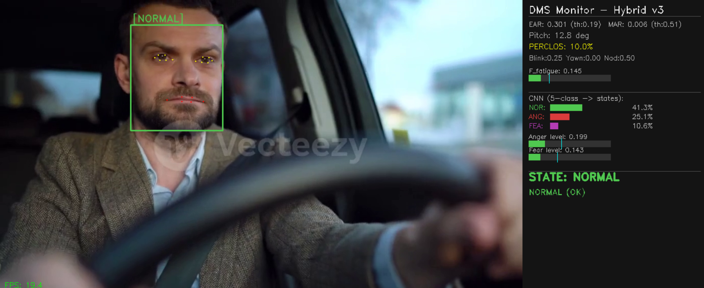 | 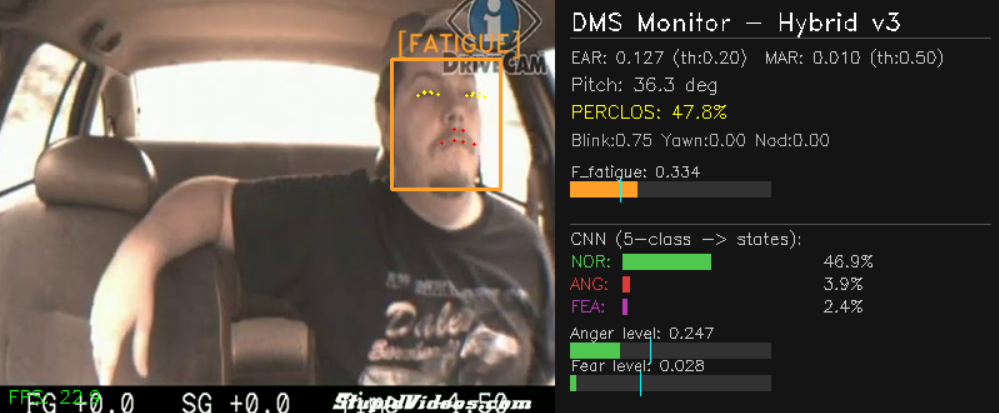 |

| **Distracted State** | **Angry State** |
| :---: | :---: |
| 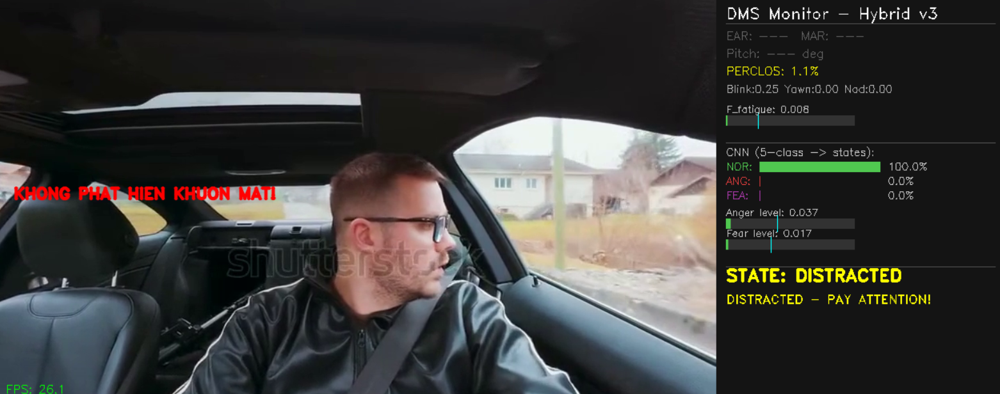 | 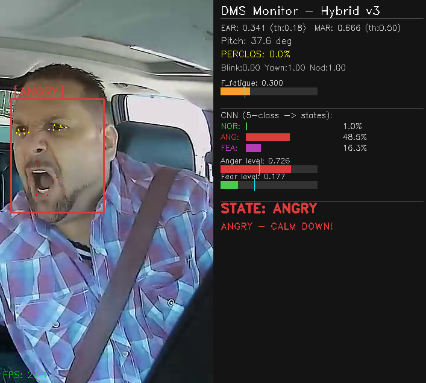 |

| **Fear State** |
| :---: |
| 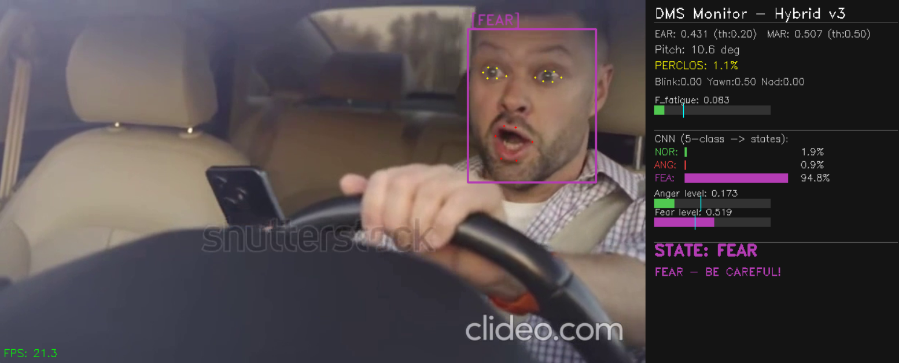 |

---

## Key Features

- **Hybrid Decision Logic:** Integrates fast geometric calculations (EAR for eye closure, MAR for yawning, Pitch for head nodding) with MobileNetV3 deep learning emotion scores.
- **Dynamic Threshold Adjustments:** EAR and MAR alarm thresholds are dynamically adjusted in real-time based on the driver's current happiness/anger probabilities to reduce false alerts due to speaking or smiling.
- **Optimized Data Syncing:** Local monitoring apps execute data transmission asynchronously on background threads. Telemetry is sent every 15 frames or immediately upon a state change to optimize device CPU performance.
- **Cross-Platform Support:** Fully functional implementations on PC (Python, OpenCV, MediaPipe) and Mobile (Flutter/Dart, Google ML Kit Face Mesh, PyTorch Mobile Lite `.ptl` format).
- **Offline Evaluation Pipeline:** Integrated classifier evaluation script generating accuracy reports, confusion matrices, and ROC curves on public datasets.

---

## Directory Structure

```
├── Fatigue Dataset/             # Fatigue evaluation dataset (Active/Fatigue subjects)
├── Emotion Dataset/             # Emotion classification datasets (RAF-DB, FER-2013, etc.)
├── dms_mobile_app/              # Flutter Mobile App Source
│   ├── lib/
│   │   ├── main.dart            # Visual display interface & Camera capture
│   │   └── dms_processor.dart   # ML Kit & PyTorch Lite inference logic
│   └── assets/                  # PyTorch Mobile Lite model & labels
├── models/                      # Model binaries (face landmarker, task files)
├── templates/                   # HTML templates for the simulation dashboard
├── static/                      # Static assets for the simulation dashboard (CSS, JS, icons)
├── config.py                    # Global system thresholds and settings
├── landmark_engine.py           # MediaPipe facial landmark extractor (PC)
├── fatigue_metrics.py           # Sliding window PERCLOS & geometric calculations
├── emotion_scorer.py            # Average emotion accumulator
├── inference.py                 # PC monitoring execution script (Visual display interface)
├── dashboard_server.py          # Centralized simulation program
├── data_preprocessing.py        # Dataset preprocessing and augmentation
├── evaluate_fatigue_detection.py# Dataset evaluation and metrics plotting
├── train.ipynb                  # MobileNetV3 emotion model training notebook
├── requirements.txt             # Dependencies for local monitoring & evaluation
└── requirements_server.txt      # Dependencies for the simulation dashboard
```


---

## Dataset Download & Directory Structure

Since the datasets are extremely large, they are not stored in this Git repository. You can download the pre-packaged datasets from Google Drive:

* **Fatigue Dataset:** [Google Drive Link](https://drive.google.com/file/d/1dxvNPF7RBDpI1MblxNtbSge-sOl-wy2_/view?usp=sharing)
* **Emotion Dataset:** [Google Drive Link](https://drive.google.com/file/d/1oarn9ye_6l4jEuAHNChA2E6iEwizqrX4/view?usp=sharing)

To run the data preprocessing (`data_preprocessing.py`) or fatigue evaluation (`evaluate_fatigue_detection.py`) scripts, download and extract the files, then organize them in the root directory as follows:

```text
├── Fatigue Dataset/
│   └── archive/
│       ├── Active Subjects/     # Active driver images (ground truth: 0)
│       └── Fatigue Subjects/    # Fatigued/drowsy driver images (ground truth: 1)
└── Emotion Dataset/
    ├── RAF-DB/                  # RAF-DB dataset
    │   ├── train/               # Folders 1 to 7
    │   └── test/                # Folders 1 to 7
    ├── MLI-DER/                 # MLI-DER dataset
    │   └── image data/          # Normal, littleBright, littleDark, veryBright folders
    ├── KMU-FED/                 # KMU-FED flat folder of images
    ├── AffectNet/               # AffectNet dataset
    │   ├── Train/               # Folders (neutral, anger, disgust, etc.)
    │   └── Test/                # Folders (neutral, anger, disgust, etc.)
    ├── FER-2013/                # FER-2013 dataset
    │   ├── train/               # Folders (neutral, angry, etc.)
    │   └── test/                # Folders (neutral, angry, etc.)
    ├── KDEF/                    # KDEF dataset (folders: neutral, angry, etc.)
    └── SFEW/                    # SFEW dataset
        ├── Train/
        ├── Val/
        └── Test/
```

---

## Installation & Setup

### 1. Prerequisites
- Python 3.8+
- Flutter SDK & Dart (for the mobile app)
- Web camera or video files for testing

### 2. Setting Up Python Virtual Environment
Since virtual environment folders are not uploaded to the repository, you must create and activate a new virtual environment manually:

```bash
# Create a new virtual environment named 'venv'
python -m venv venv

# Activate the virtual environment:
# On Windows (PowerShell):
.\venv\Scripts\Activate.ps1
# On Windows (Command Prompt):
.\venv\Scripts\activate.bat
# On Linux / macOS:
source venv/bin/activate

# Install all required dependencies
pip install -r requirements.txt
```

### 3. Running the System

#### Step A: Start the Centralized Simulation Program
Run the simulation dashboard program first. It initializes the local SQLite database (`dms_database.db`) and opens a web interface at port `5000`:
```bash
python dashboard_server.py
```
Open `http://localhost:5000` in your web browser to view the **Monitoring Simulation UI**.

#### Step B: Start the PC App
Open a new terminal window (activate the virtual environment first) and run the local monitoring program:
```bash
# Run using default webcam (source 0)
python inference.py --source 0

# Run using a test video file
python inference.py --source video_test/test_driver.mp4
```
The program will stream telemetry to the simulation dashboard automatically. Press `Q` or `ESC` on the camera window to close the visual display interface. Upon closing, the terminal will output execution metrics including FPS and CPU/RAM resources.

#### Step C: Run the Mobile App (Flutter)
Ensure you have a mobile device (with USB debugging enabled) connected or an emulator open:
```bash
cd dms_mobile_app
flutter pub get
flutter run
```

---

## Performance Evaluation

To evaluate the fatigue detection algorithm on the static `Fatigue Dataset` and generate performance plots:
```bash
python evaluate_fatigue_detection.py
```
The evaluation report and plots (Confusion Matrix, ROC Curve) will be saved under the [SOICT_DATN/Hinhve/](file:///d:/StudyPath/Practice/advertising-system/SOICT_DATN/Hinhve) directory.

### Evaluation Metrics & Distributions

| Confusion Matrix | EAR & MAR Distribution |
| :---: | :---: |
| 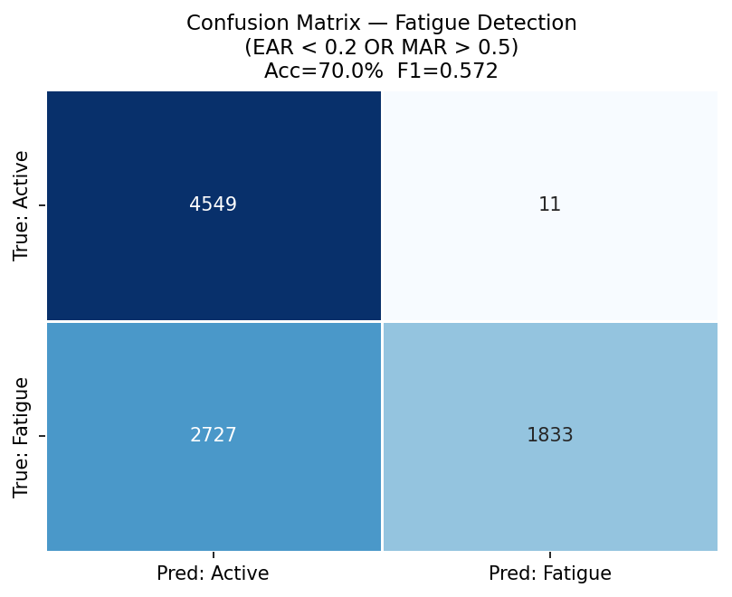 | 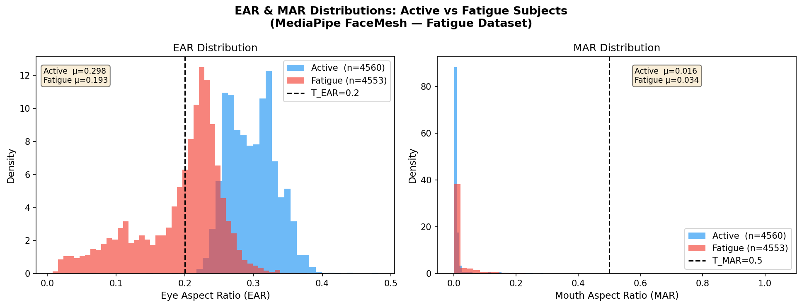 |

### Model Training Curves
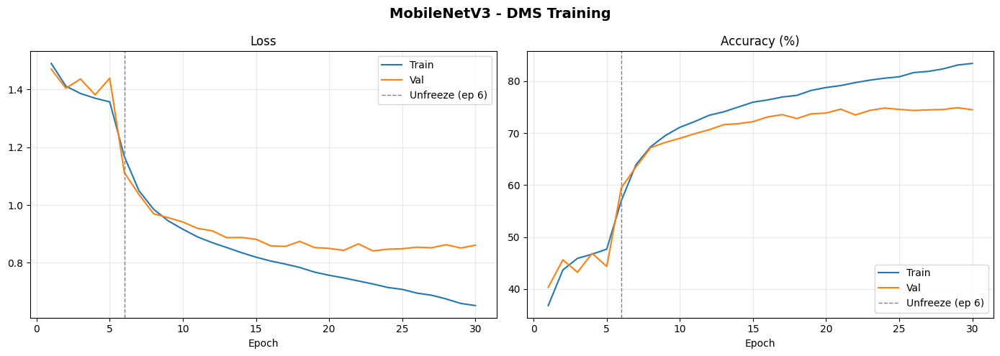

---

## License

Distributed under the MIT License. See `LICENSE` for more information.
